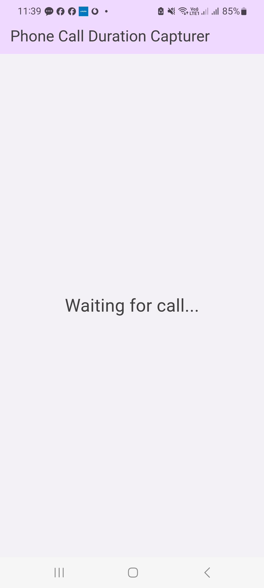
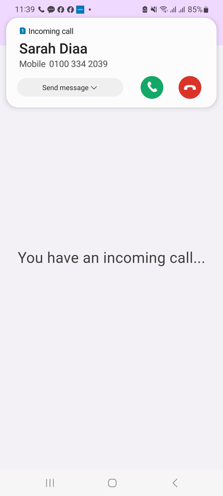
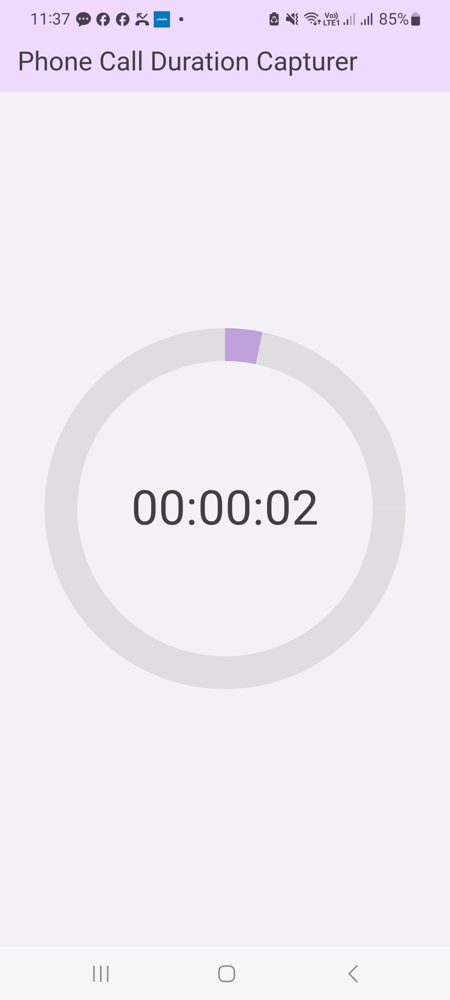
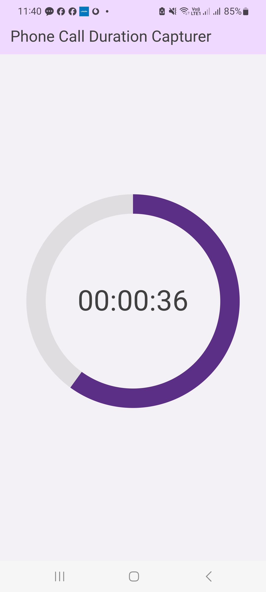
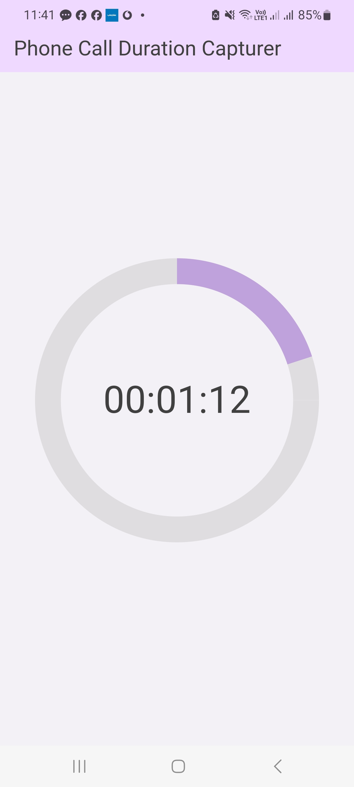

# Call Duration Capturer

Call Duration Capturer is a Flutter application that monitors phone call events and displays the duration of the most recent phone call. The app includes a timer UI with a circular progress indicator that updates based on the duration of the call.

## Features

- Captures phone call events (incoming, started, ended)
- Displays call duration in hours, minutes, and seconds
- Circular progress indicator that resets every minute
- Customizable colors based on the duration of the call
- Works in both debug and release modes for Android

## Prerequisites

- Flutter SDK
- Android Studio (for Android development)
- An Android device or emulator

## Getting Started

1. **Clone the repository:**

   ```bash
   git clone https://github.com/your-username/call-duration-capturer.git
   cd call-duration-capturer
   ```

2. **Install dependencies:**

    ```bash
    flutter pub get
    ```

3. **Run App:**

    ```bash
    flutter run
    ```

## Permissions

The app requires phone permissions to capture call events. It requests these permissions at runtime.

## Notes

The current implementation is only available for Android. This is due to the lack of a macOS development device required for iOS development.

## Code Overview

### Main File

- `main.dart` : The main entry point of the application. It contains the CallDurationApp class, which handles phone state changes and displays the UI.

### Key Components

- **Permissions Handling:** The app requests phone permissions at runtime using the `permission_handler` package.

- **Phone State Monitoring:** The app listens to phone state changes using the `phone_state` package.

- **UI:** The app uses Flutter widgets to build the UI, including a circular progress indicator to display the call duration.

### Screenshots






